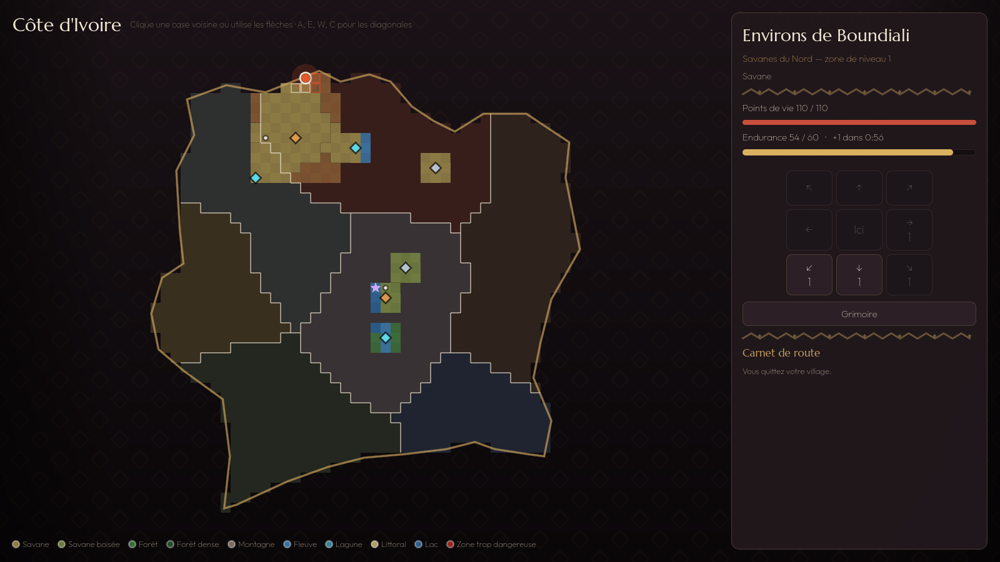
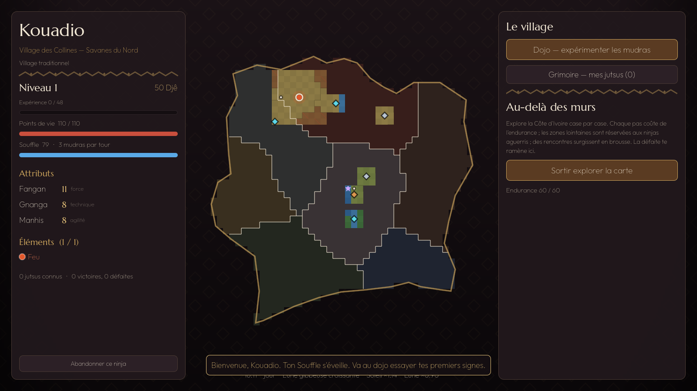
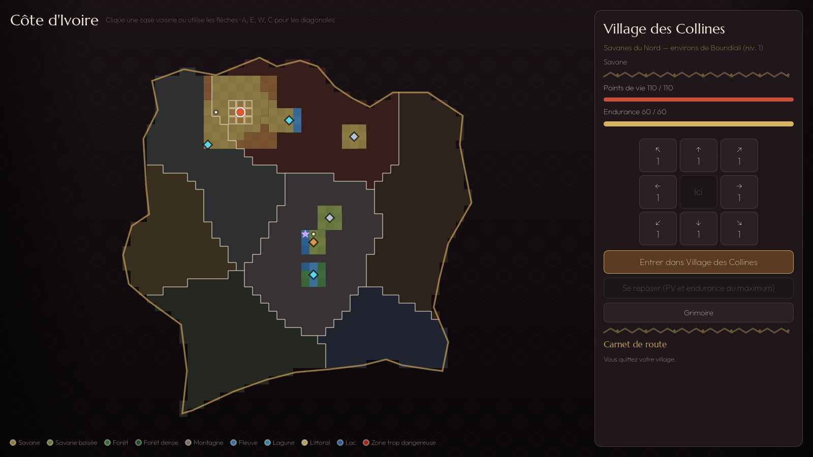
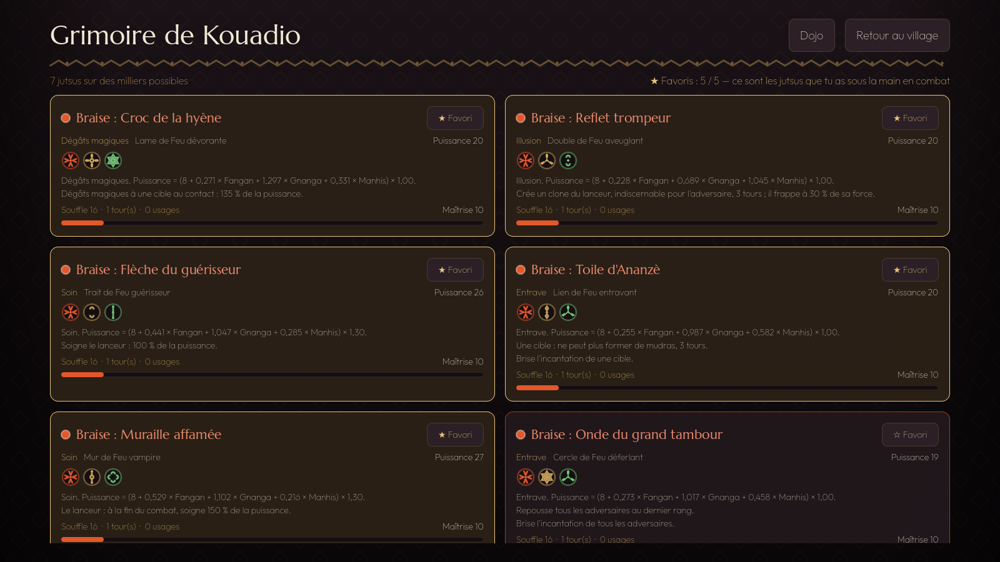
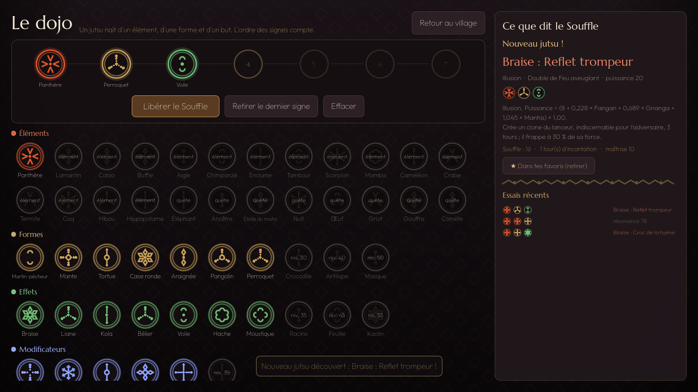
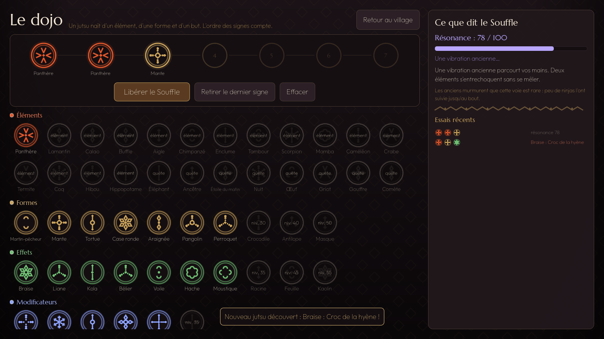
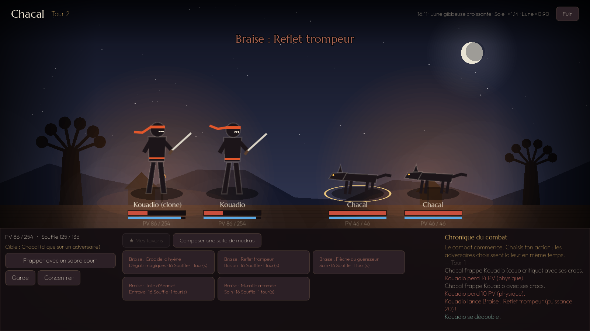

# Ninja Ivoire

Jeu PC de ninjas, stratégique et persistant, dont le monde est la **Côte d'Ivoire**.

- **Mudras et jutsus secrets :** 50 signes de la main, une grammaire où l'ordre compte, **4 000 familles de jutsus et plus de 4 millions de variantes** à découvrir.
- **16 éléments de base, 16 rares, 8 mythiques**, chacun avec ses forces et ses faiblesses.
- **Combat au tour par tour simultané**, avec des positions à la *Darkest Dungeon*.
- **7 régions, 21 villages** (traditionnels, modernes, futuristes) et une **guerre du vendredi soir** pour les zones.
- **Économie portée par les joueurs**, avec le **Djê** comme monnaie.



## Jouer au prototype (Windows)

1. Onglet **Actions** du dépôt → dernier run vert de **« Construire Ninja Ivoire »**.
2. Télécharger l'artefact **`NinjaIvoire-Windows`**, puis clic droit → « Extraire tout… ».
3. Double-cliquer sur **`NinjaIvoire.exe`** (garder `NinjaIvoire.pck` à côté).

Le jeu tourne entièrement sur le PC. `NinjaIvoire.exe` est l'exécutable officiel de Godot, non modifié ; le jeu lui-même est dans `NinjaIvoire.pck`.

## Ce que contient le prototype 0.1

| Écran | Contenu |
|---|---|
| Création | Nom, 6 régions jouables (élément et attribut de départ), 3 types de village |
| Village | Fiche du ninja, aperçu de la carte explorée, heure réelle et phase de la lune, choix d'élément |
| Carte | La Côte d'Ivoire en 1 352 cases : 9 terrains, 7 régions, 56 zones à niveau, 21 villages, 46 villes, lieux mythiques, portails ; déplacement case par case, endurance, brouillard, rencontres |
| Dojo | Composer jusqu'à 7 mudras, libérer le Souffle, découvrir un jutsu ou écouter la résonance |
| Grimoire | Jutsus découverts, pour toujours : type, formule de puissance, effets exacts, maîtrise ; jusqu'à 5 favoris (★) |
| Combat | Tours simultanés, trois rangs, incantation, interruption ; 5 types de jutsus (dégâts physiques, magiques ou purs, défense, entrave, illusion avec clones indiscernables, soin) ; seuls les favoris et les suites inconnues se lancent ; blessures durables |

Les jutsus portent des noms poétiques (« Braise : Croc de la hyène », « Lagune : Toile d'Ananzè, qui dévore — sans fin »), avec leur nature en dessous (« Lame de Feu dévorante »).

| | |
|---|---|
|  |  |
|  |  |
|  |  |

## Architecture

- **`server/`** : moteur de règles et serveur en **Go** (bibliothèque standard uniquement). C'est la **référence** des règles, et le futur serveur du jeu en ligne.
  - `cmd/exporter-regles` : écrit `client/donnees/regles.json` (données du jeu, recettes légendaires sous forme d'empreintes SHA-256) et les vecteurs de test du client.
  - `internal/data` : éléments, mudras, régions, Soleil et Lune.
  - `internal/carte` : génération de la carte (terrains, régions, zones, lieux).
  - `internal/grammar` : suite de mudras → jutsu, résonance, légendaires (secret).
  - `internal/combat` : moteur de combat et IA.
  - `internal/game` : ninja, grimoire, maîtrise, niveaux, rencontres, sauvegarde.
  - `internal/api` : API HTTP JSON pour le client.
- **`client/`** : jeu PC en **Godot 4.4** (GDScript).
  - `scripts/moteur` : copie fidèle des règles Go, pour jouer sans serveur (prototype hors ligne). Un test vérifie la parité avec Go (noms, effets, coefficients, textes) sur près de 3 000 suites de mudras.
  - Avec l'option `-- --serveur`, le client utilise le serveur Go en HTTP (développement, futur mode en ligne).

## Développer

```bash
# Serveur : tests (dont l'énumération complète de la grammaire)
cd server && go test ./...

# Serveur seul
go run ./cmd/ninja-server            # http://127.0.0.1:7777

# Après une modification des règles Go : régénérer les données du client
go run ./cmd/exporter-regles -sortie ../client/donnees -tests ../client/tests

# Client : ouvrir client/ dans Godot 4.4 ; tests du moteur local
godot --headless --path client --script res://tests/test_grammaire.gd
godot --headless --path client --script res://tests/test_partie.gd
godot --headless --path client --script res://tests/test_combat.gd

# Démo automatique avec captures d'écran
godot --path client -- --demo=/tmp/captures
```

## Documents

- [Document de conception (GDD)](docs/GDD.md)
- [Feuille de route](docs/ROADMAP.md)

## Équipe

- **Conception :** Terence
- **Développement :** Claude

Polices : Marcellus et Outfit, sous licence SIL Open Font License (voir `client/assets/fonts`).
