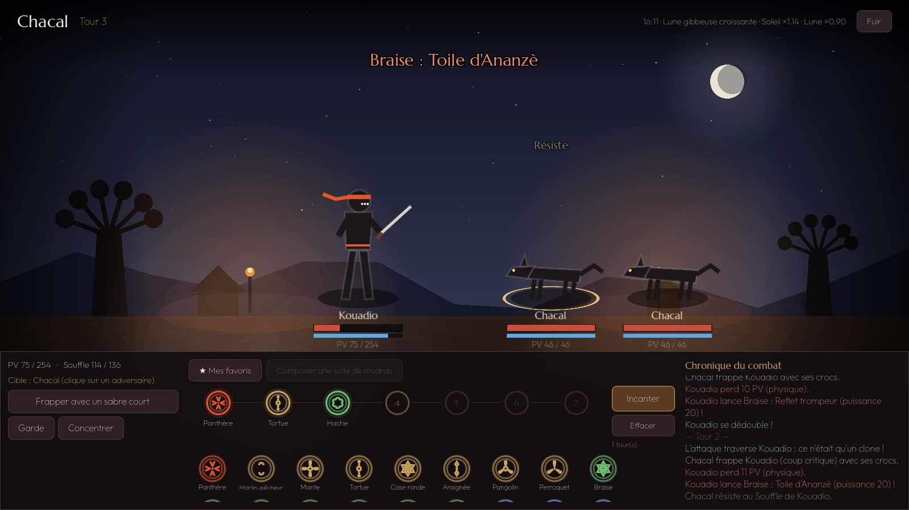
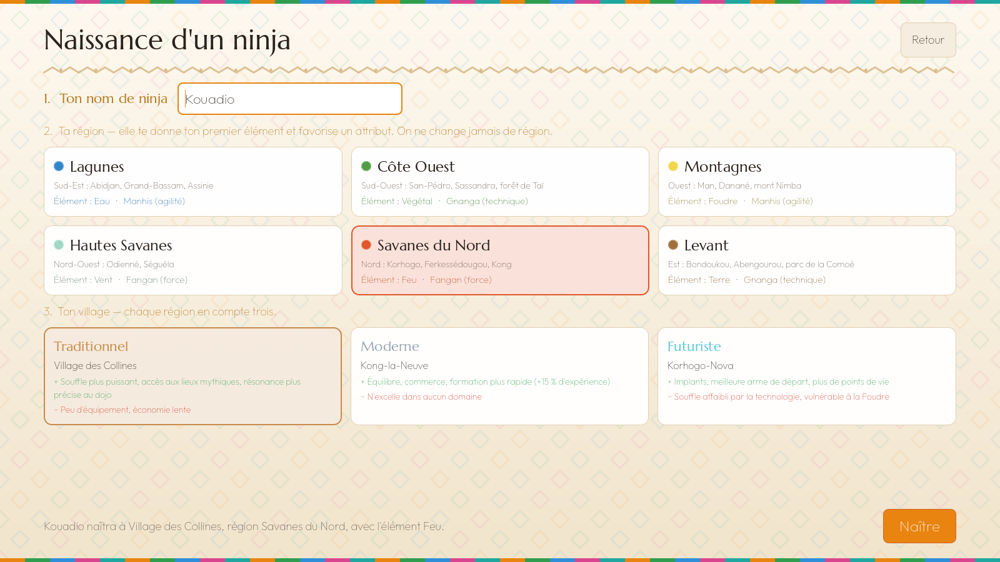

# Ninja Ivoire

Jeu PC de ninjas, stratégique et persistant, dont le monde est la **Côte d'Ivoire**.

- **Mudras et jutsus secrets :** 50 signes de la main, une grammaire où l'ordre compte, **4 000 familles de jutsus et plus de 4 millions de variantes** à découvrir.
- **16 éléments de base, 16 rares, 8 mythiques**, chacun avec ses forces et ses faiblesses.
- **Combat au tour par tour simultané**, avec des positions à la *Darkest Dungeon*.
- **7 régions, 21 villages** (traditionnels, modernes, futuristes) et une **guerre du vendredi soir** pour les zones.
- **Économie portée par les joueurs**, avec le **Djê** comme monnaie.



## Jouer au prototype (Windows)

1. Onglet **Actions** du dépôt → dernier run vert de **« Construire Ninja Ivoire »**.
2. Télécharger l'artefact **`NinjaIvoire-Windows`** et le dézipper.
3. Double-cliquer sur **`NinjaIvoire.exe`** (garder `ninja-server.exe` à côté).

## Ce que contient le prototype 0.1

| Écran | Contenu |
|---|---|
| Création | Nom, 6 régions jouables (élément et attribut de départ), 3 types de village |
| Village | Fiche du ninja, carte des 7 régions, heure réelle et phase de la lune, choix d'élément, combats |
| Dojo | Composer jusqu'à 8 mudras, libérer le Souffle, découvrir un jutsu ou écouter la résonance |
| Grimoire | Jutsus découverts, pour toujours, avec leur maîtrise |
| Combat | Tours simultanés, trois rangs, incantation sur plusieurs tours, interruption, IA qui lit la situation |

| | |
|---|---|
|  |  |
|  |  |

## Architecture

- **`server/`** : moteur de règles et serveur en **Go** (bibliothèque standard uniquement). Toute la logique vit ici : grammaire des mudras, recettes et conditions des légendaires, combat, progression. **Le client ne connaît jamais les recettes.**
  - `internal/data` : éléments, mudras, régions, Soleil et Lune.
  - `internal/grammar` : suite de mudras → jutsu, résonance, légendaires (secret).
  - `internal/combat` : moteur de combat et IA.
  - `internal/game` : ninja, grimoire, maîtrise, niveaux, rencontres, sauvegarde.
  - `internal/api` : API HTTP JSON pour le client.
- **`client/`** : jeu PC en **Godot 4.4** (GDScript). Il lance le serveur local tout seul au démarrage.

## Développer

```bash
# Serveur : tests (dont l'énumération complète de la grammaire)
cd server && go test ./...

# Serveur seul
go run ./cmd/ninja-server            # http://127.0.0.1:7777

# Client : compiler le serveur à côté, puis ouvrir client/ dans Godot 4.4
go build -o ninja-server ./cmd/ninja-server

# Démo automatique avec captures d'écran
godot --path client -- --demo=/tmp/captures
```

## Documents

- [Document de conception (GDD)](docs/GDD.md)
- [Feuille de route](docs/ROADMAP.md)

## Équipe

- **Conception :** Terence
- **Développement :** Claude

Polices : Marcellus et Outfit, sous licence SIL Open Font License (voir `client/assets/fonts`).
